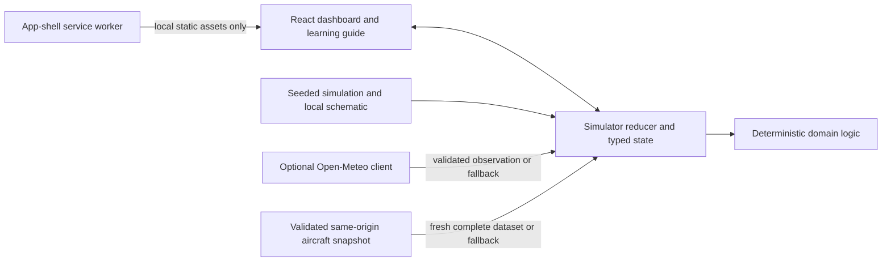

# FutureATC Lab

FutureATC Lab is an explainable, AI-assisted air traffic management simulator built for an
academic research study. It turns deterministic synthetic traffic, weather, runway, fuel, and
emergency inputs into transparent educational recommendations that always remain subject to human
review.

> This is an academic simulation for educational demonstration only. It is not an operational air
> traffic control, navigation, collision-avoidance, flight-planning, or safety system.

The public project intentionally omits the student name, enrollment information, private report,
guide, department, contact details, and credentials. It represents original software created from
a conceptual research study; it does not claim a trained machine-learning model or prior
operational system.

## What can be demonstrated

- Five reproducible scenarios: Normal traffic, Severe weather, Collision risk, Low fuel, and
  Emergency.
- Synchronized aircraft movement, heading markers, list selection, details, and statistics.
- Ten-minute constant-velocity closest-point-of-approach (CPA) projection with visible thresholds,
  inputs, results, limitations, and human-review guidance.
- Deterministic simulated weather plus optional validated Open-Meteo observations and an honest
  fallback state.
- Explainable runway scoring, simulated fuel endurance, stable emergency priority, and
  browser-only confirm/reject actions with no external effect.
- Optional validated `adsb.fi` regional snapshots that never mix with simulated aircraft and never
  fabricate unsupported fuel, intent, runway, or emergency data.
- Connected OpenStreetMap tiles with a complete local schematic fallback.
- A seven-module “How It Works” guide, glossary, provider attribution, privacy boundary, and
  five-minute evaluator path.
- A warm-load offline app shell; external freshness checks still require a network.

The default demonstration region is Lucknow. Its center, bounds, runway labels, aircraft cap, map
zoom, external radius, and freshness limit are centralized in
[`src/config/regions.ts`](src/config/regions.ts), so another approved demonstration configuration
can be added without changing the decision algorithms.

## Run locally

Prerequisites are Node.js 24.15.x and npm 11 or 12.

```bash
npm ci
npm run dev
```

Vite serves the application under its repository base:
`/ai-air-traffic-management/`.

To test the exact production bundle locally:

```bash
npm run build
npm run verify:build
npm run preview
```

The production workflow remains disabled until the separate Gate 5 release approval. A local build
does not publish or contact the aircraft provider.

## Architecture



- `src/domain/` contains pure or boundary-focused logic for scenarios, movement, collision
  projection, weather validation, runway scoring, fuel, priority, statistics inputs, and external
  snapshot normalization.
- `src/app/SimulatorProvider.tsx` owns provider requests and reducer orchestration.
- `src/components/` renders source-aware, keyboard-accessible views and explanations.
- `scripts/fetch-aircraft-snapshot.ts` is the only aircraft-provider client. It is intended for the
  gated GitHub workflow, makes one guarded regional request, validates the response, and publishes
  a same-origin status envelope.
- `vite.config.ts` fixes the Pages base path and caches only the local app shell. The changing
  aircraft snapshot and OpenStreetMap tiles are not precached.

## Explainable rules

All values below are configurable educational defaults, not operational minima or airport rules.

| Capability           | Implemented rule                                                                                                                                                                                                            |
| -------------------- | --------------------------------------------------------------------------------------------------------------------------------------------------------------------------------------------------------------------------- |
| Collision projection | Constant ground velocity is projected for at most 600 seconds. Critical is `<5 NM` and `<1,000 ft`; Warning is `<8 NM` and `<2,000 ft`; Monitor is `<12 NM` and `<3,000 ft`.                                                |
| Weather risk         | Severe if gust `>=35 kt`, visibility `<3 km`, precipitation `>=7.5 mm/h`, or a thunderstorm code. Elevated if wind `>=20 kt`, gust `>=25 kt`, visibility `<8 km`, precipitation `>=2.5 mm/h`, or a configured adverse code. |
| Runway score         | A valid candidate starts at 50. Bounded headwind, crosswind, tailwind, queue, arrival, fuel, conflict, and `+100` simulated-emergency contributions remain visible. An unavailable runway is disqualified.                  |
| Fuel state           | Remaining synthetic fuel is `initial fuel - estimated burn × elapsed time`. Endurance `<30 min` is Low and `<15 min` is Critical. External fuel is Unavailable.                                                             |
| Landing priority     | Stable ordering uses simulated emergency, critical fuel, critical projected conflict, severe weather, low fuel, estimated arrival, then original order.                                                                     |
| Statistics           | Values derive only from the complete active dataset. Invalid observations are excluded with denominators disclosed; unsupported fields are Unavailable.                                                                     |

The interface describes these as deterministic decision-support rules. It does not claim model
training, predictive accuracy, safety assurance, or autonomous control.

## Data modes and failure behavior

Simulation is the default and complete mode. It is deterministic for the same scenario seed and
does not need an external API.

Observed weather is fetched only after the user chooses **Check observed weather**. The request
sends the configured demonstration-region coordinates to Open-Meteo. A valid response is cached in
the browser for 15 minutes. Network, timeout, HTTP, rate-limit, schema, timestamp, coordinate, or
storage failures retain or restore simulated weather and show the reason.

External aircraft mode reads one same-origin JSON snapshot. It activates only if the entire
envelope is valid and no older than the configured 30-minute limit. Network/CORS-style failures,
non-success responses, invalid JSON/schema, inconsistent or stale timestamps, provider
unavailability, and expired or empty-invalid results preserve Simulation. A valid fresh empty
snapshot is shown honestly as empty. Retry time is displayed only when supplied by a valid provider
response.

No external aircraft is combined with simulated aircraft. Unsupported fuel, intent, runway,
emergency, and operational fields remain Unavailable. CPA applied to external tracks is labelled an
educational geometric projection and cannot establish actual collision danger.

## Privacy, security, and provider use

- No accounts, cookies for tracking, analytics, advertising, payments, or personal-data collection.
- No secret is needed or embedded in the browser. GitHub Actions uses minimum permissions and
  commit-pinned actions.
- The static site sends only the configured Lucknow coordinates when observed weather is requested.
  Aircraft snapshots are built by the gated workflow, not fetched from `adsb.fi` by a visitor’s
  browser.
- The offline worker caches local versioned assets, not the changing aircraft snapshot or bulk map
  tiles.
- Provider availability, accuracy, coverage, timing, and terms are not guaranteed and are rechecked
  before deployment.

Sources and licences:

- Map tiles and data: [OpenStreetMap contributors](https://www.openstreetmap.org/copyright), subject
  to the [standard tile policy](https://operations.osmfoundation.org/policies/tiles/).
- Map rendering: [Leaflet 1.9.4](https://leafletjs.com/) under BSD-2-Clause.
- Optional weather: [Open-Meteo](https://open-meteo.com/), CC BY 4.0. Weather classifications are
  derived by FutureATC Lab.
- Optional aircraft snapshots: [adsb.fi](https://adsb.fi/) under its documented
  [open-data terms](https://github.com/adsbfi/opendata/blob/main/README.md), for this personal,
  non-commercial, ad-free educational project.
- Application source: MIT; see [`LICENSE`](LICENSE).

## Verification

```bash
npm run check
npm run test:e2e
npm audit --omit=dev
```

`npm run check` enforces formatting, lint, strict TypeScript, unit/component coverage, the production
build, exact Pages-base and PWA artifact checks, and the privacy scan. Playwright serves the built
site at the repository base and covers scenarios, explanations, external fixtures, offline
behavior, accessibility, 200% reflow, and 1440/768/390/320 layouts.

The acceptance trace and current release-candidate evidence are in
[`docs/release-candidate-evidence.md`](docs/release-candidate-evidence.md). Full requirements and the
approved implementation plan are in [`docs/requirements.md`](docs/requirements.md) and
[`docs/implementation-plan.md`](docs/implementation-plan.md).

## Five-minute evaluator path

1. Start in Normal traffic, select an aircraft, and compare its marker, list row, and detail.
2. Choose Collision risk, open **Why this result?**, and inspect the CPA rule and limitation.
3. Choose Severe weather and compare the reciprocal runway score contributions.
4. Choose Low fuel and Emergency, then inspect landing priority and the simulated human actions.
5. Optionally check weather or aircraft provider data, observe provenance/fallback, and return to
   the complete Simulation mode.

## Known limitations

This prototype omits authoritative surveillance, intent, clearances, certified separation logic,
aircraft performance, airport procedures, METAR/TAF/SIGMET, radar, NOTAMs, runway condition reports,
and controller or pilot reports. Public aircraft coverage can be incomplete, inaccurate, delayed,
or empty. Open-Meteo can be unavailable or spatially coarse. Offline use requires one successful
warm load. The simulated human actions never communicate with aircraft, controllers, airports, or
emergency services.
