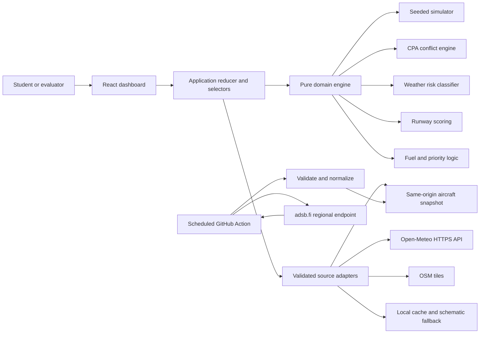
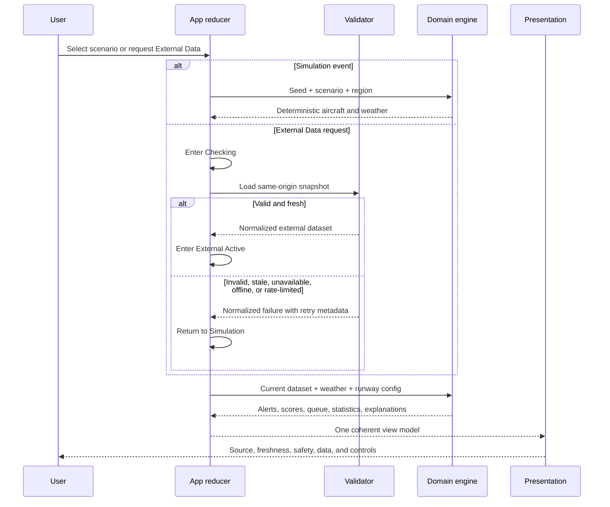
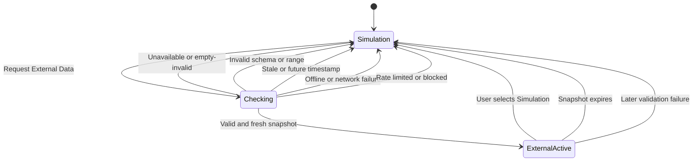

# FutureATC Lab — Execution Plan and Implementation Checklist

**Project:** FutureATC Lab — AI-Assisted Air Traffic Management Simulator<br>
**Repository:** `ai-air-traffic-management`<br>
**Target:** `https://gauravpandey4.github.io/ai-air-traffic-management/`<br>
**Plan version:** 1.0<br>
**Prepared:** 28 July 2026<br>
**Status:** Gate 3 approval candidate

> This plan authorizes architecture and implementation sequencing only. Git initialization, repository creation, package installation, application code, pull requests, and deployment remain prohibited until the relevant later gate is explicitly approved.

## 1. Plan objectives

This plan converts the approved requirements into a sequential, reviewable implementation program. It is designed to:

- deliver the complete simulator in small pull requests;
- keep deterministic Simulation mode usable without external services;
- isolate external providers behind validated adapters;
- make every automated recommendation explainable;
- preserve clear human authority and academic honesty;
- meet responsive and accessibility targets;
- prevent private information and credentials from entering the repository;
- keep the static GitHub Pages architecture free of paid services and secrets; and
- provide enough automated and manual evidence to approve Gate 4 and deploy safely in Gate 5.

## 2. Gate boundaries

### Gate 3 permits

- architecture and workflow decisions;
- dependency and provider research;
- this local implementation checklist;
- task-memory updates.

### Gate 3 prohibits

- Git initialization;
- GitHub repository creation;
- npm package installation;
- application or test code;
- branches, commits, pull requests, or merges;
- Pages configuration or deployment.

### Gate 4 will permit

- the minimal `main` bootstrap;
- public repository creation after confirming no repository collision;
- dependency installation;
- implementation through the approved sequential PR series;
- merging only after all required checks pass.

### Gate 5 will permit

- production Pages activation;
- live scheduled refresh activation;
- deployment and public-site verification;
- release-only fixes through new PRs.

## 3. Engineering baseline

### 3.1 Runtime and build baseline

| Area                    | Approved choice                                        | Rationale                                                                        |
| ----------------------- | ------------------------------------------------------ | -------------------------------------------------------------------------------- |
| Runtime                 | Node.js 24.16.x, recorded in `.nvmrc`                  | Matches the verified local runtime and satisfies selected tool engines           |
| Package manager         | npm 11.x with committed lockfile                       | Already available, reproducible with `npm ci`                                    |
| UI                      | React 19.2.x                                           | Current stable React line and compatible with the testing baseline               |
| Build                   | Vite 8.1.x                                             | Static production output, fast testing integration, configurable Pages base path |
| Language                | TypeScript 6.0.3 in strict mode                        | Latest line currently accepted by TypeScript-ESLint                              |
| Styling                 | CSS Modules plus global CSS variables                  | No runtime styling dependency; scoped components and coherent tokens             |
| State                   | React reducer/context plus pure domain functions       | Avoids an unnecessary global-state dependency                                    |
| Map                     | Leaflet 1.9.4 through a small typed imperative adapter | Lightweight, permissive BSD licence, works with OSM raster tiles                 |
| Icons                   | Lucide React 1.27.x                                    | Accessible SVG icon components under the ISC licence                             |
| Validation              | Zod 4.4.x                                              | Runtime validation for untrusted provider and cached data                        |
| Offline shell           | Vite PWA Plugin 1.3.x / Workbox                        | Generates an app-shell service worker without a backend                          |
| Test runner             | Vitest 4.1.x                                           | Shares Vite configuration and supports deterministic unit/component tests        |
| Components              | React Testing Library 16.3.x                           | Behavior-focused accessible component tests                                      |
| Browser tests           | Playwright 1.62.x                                      | Production-build smoke, responsive, offline, and base-path tests                 |
| Accessibility           | JSX a11y linting plus Axe Playwright and manual checks | Mechanical checks supplemented by keyboard/focus/zoom review                     |
| API mocking             | MSW 2.15.x and static fixtures                         | Stable success/failure testing without calling providers in CI                   |
| Node TypeScript scripts | `tsx` 4.23.x                                           | Runs the typed aircraft snapshot script in Actions                               |

All exact versions must be rechecked immediately before Gate 4 installation. A compatible patch update may be selected and recorded; a major-version change or licence change requires documented review.

The browser target is Vite 8's default Baseline Widely Available set: Chrome 111+, Edge 111+, Firefox 114+, Safari/iOS 16.4+. This is appropriate for a current college demonstration; no legacy-browser plugin is planned.

### 3.2 Planned production dependencies

| Package        | Planned version | Licence      | Use                                 |
| -------------- | --------------: | ------------ | ----------------------------------- |
| `react`        |          19.2.8 | MIT          | UI runtime                          |
| `react-dom`    |          19.2.8 | MIT          | DOM rendering                       |
| `leaflet`      |           1.9.4 | BSD-2-Clause | Interactive connected map           |
| `lucide-react` |          1.27.0 | ISC          | Interface icons                     |
| `zod`          |           4.4.3 | MIT          | External and cached data validation |

`vite-plugin-pwa` is a build-time dependency but affects production behavior through the generated service worker.

### 3.3 Planned development dependencies

| Package group  | Planned versions                                                                                                                                                                                       |
| -------------- | ------------------------------------------------------------------------------------------------------------------------------------------------------------------------------------------------------ |
| Vite           | `vite` 8.1.5; `@vitejs/plugin-react` 6.0.4                                                                                                                                                             |
| TypeScript     | `typescript` 6.0.3; `@types/node` 24.13.3; `@types/react` 19.2.17; `@types/react-dom` 19.2.3; `@types/leaflet` 1.9.21; `tsx` 4.23.1                                                                    |
| Lint/format    | `eslint` 9.39.5; `@eslint/js` 9.39.5; `typescript-eslint` 8.65.0; `eslint-plugin-react-hooks` 7.1.1; `eslint-plugin-react-refresh` 0.5.3; `eslint-plugin-jsx-a11y` 6.10.2; `prettier` 3.9.6            |
| Unit/component | `vitest` 4.1.10; `@vitest/coverage-v8` 4.1.10; `jsdom` 30.0.0; `@testing-library/dom` 10.4.1; `@testing-library/react` 16.3.2; `@testing-library/jest-dom` 7.0.0; `@testing-library/user-event` 14.6.1 |
| Browser/a11y   | `@playwright/test` 1.62.0; `@axe-core/playwright` 4.12.1                                                                                                                                               |
| PWA/mocking    | `vite-plugin-pwa` 1.3.0; `msw` 2.15.0                                                                                                                                                                  |

### 3.4 Rejected dependency alternatives

| Alternative                       | Decision and reason                                                                                                                                                                                                          |
| --------------------------------- | ---------------------------------------------------------------------------------------------------------------------------------------------------------------------------------------------------------------------------- |
| TypeScript 7.0.2                  | Deferred. Current `typescript-eslint` 8.65.0 declares TypeScript support below 6.1, so TypeScript 7 would create an unsupported lint toolchain.                                                                              |
| `react-leaflet` 5.0.0             | Rejected. Its current Hippocratic-2.1 licence is not the conventional permissive dependency baseline selected for this public academic repository. Direct Leaflet keeps the dependency permissive and the integration small. |
| Redux/Zustand                     | Not needed. The application has one bounded simulator state tree and benefits from explicit reducer events and pure selectors.                                                                                               |
| Tailwind or a component framework | Not needed. Custom CSS variables and modules better support the distinctive ATC visual language without shipping a generic design system.                                                                                    |
| Mapbox/Google Maps                | Rejected due to credentials, cost, terms, or unnecessary service coupling.                                                                                                                                                   |
| OpenSky deployed API              | Rejected in Gate 1/2 because current terms require written licensing for this automated live-service path.                                                                                                                   |
| A custom backend                  | Rejected. GitHub Pages plus scheduled Actions and same-origin JSON satisfy the approved scope.                                                                                                                               |

### 3.5 Current verification evidence

Package versions, licences, engines, and peer dependencies were checked from the public npm registry on 28 July 2026. Official implementation references were also rechecked:

- [Vite production build, browser compatibility, and public base path](https://vite.dev/guide/build)
- [Leaflet 1.9.4 API and tile attribution](https://leafletjs.com/reference)
- [Vite PWA service-worker strategies](https://vite-pwa-org.netlify.app/guide/service-worker-strategies-and-behaviors)
- [Playwright continuous-integration guidance](https://playwright.dev/docs/ci)
- [GitHub Pages custom Actions workflows](https://docs.github.com/en/pages/getting-started-with-github-pages/using-custom-workflows-with-github-pages)
- [GitHub Actions schedule behavior](https://docs.github.com/en/actions/reference/workflows-and-actions/events-that-trigger-workflows)
- [OpenStreetMap Standard tile policy](https://operations.osmfoundation.org/policies/tiles/)

Current official action releases and immutable commit IDs were checked through the GitHub API. Provider-specific evidence remains in `docs/requirements.md` and task memory.

## 4. Overall architecture

FutureATC Lab will be a static React single-page application with a pure deterministic domain core. Browser adapters provide optional weather, map tiles, cache, connectivity, and same-origin aircraft snapshots. No provider data enters application state until it passes schema, range, timestamp, and freshness validation.



### 4.1 Architectural layers

1. **Configuration**
   - typed region, runway, threshold, quota, cache, and UI settings;
   - Lucknow default isolated from algorithms;
   - production base path in one Vite setting.

2. **Domain**
   - pure TypeScript types, calculations, classifiers, scores, selectors, and explanations;
   - no React, network, browser storage, wall-clock, or provider-specific code;
   - injected clock and deterministic pseudo-random generator.

3. **Simulation**
   - named seeded scenarios;
   - predictable tick/update loop;
   - scenario reset and replay;
   - synthetic callsign namespace.

4. **Data adapters**
   - same-origin aircraft snapshot reader;
   - direct Open-Meteo reader with client cache;
   - typed Leaflet adapter;
   - local schematic map fallback;
   - connectivity, storage, and application clock adapters.

5. **Application state**
   - reducer events are the only state mutation path;
   - aircraft data mode and weather source state are explicit;
   - derived statistics and recommendations are selectors, not independently mutable copies.

6. **Presentation**
   - semantic React components;
   - accessible text equivalents for map and charts;
   - source/freshness/safety state visible at all viewport sizes.

7. **Build and release**
   - CI validates every PR;
   - Pages workflow is committed but release-guarded until Gate 5;
   - snapshot generation happens in the runner and is never committed as long-term history.

### 4.2 Design constraints

- External aircraft and simulated aircraft never share the active dataset.
- Weather may independently be observed, cached, or simulated; a mixed-source summary is mandatory when aircraft and weather modes differ.
- Provider fields never acquire simulated values silently.
- Recommendations are recalculated from current facts rather than stored as authoritative state.
- A stale snapshot cannot remain active.
- External-service errors never blank or disable the simulator.

## 5. Planned project structure

```text
ai-air-traffic-management/
├── .codex/
│   ├── MEMORY.md
│   └── task-memory.md
├── .github/
│   ├── dependabot.yml
│   └── workflows/
│       ├── ci.yml
│       └── pages.yml
├── docs/
│   ├── implementation-plan.md
│   ├── requirements.docx
│   └── requirements.md
├── e2e/
│   ├── accessibility.spec.ts
│   ├── base-path.spec.ts
│   ├── external-fallback.spec.ts
│   ├── offline.spec.ts
│   ├── responsive.spec.ts
│   └── scenarios.spec.ts
├── public/
│   ├── data/
│   │   └── aircraft-snapshot.json
│   ├── favicon.svg
│   ├── icons/
│   └── manifest.webmanifest
├── scripts/
│   └── refresh-aircraft-snapshot.ts
├── src/
│   ├── app/
│   │   ├── App.tsx
│   │   ├── AppProvider.tsx
│   │   ├── appReducer.ts
│   │   ├── appSelectors.ts
│   │   └── appTypes.ts
│   ├── components/
│   │   ├── common/
│   │   ├── layout/
│   │   └── status/
│   ├── config/
│   │   ├── regions.ts
│   │   ├── thresholds.ts
│   │   └── runtime.ts
│   ├── data/
│   │   ├── aircraftSnapshot.ts
│   │   ├── cache.ts
│   │   ├── connectivity.ts
│   │   ├── openMeteo.ts
│   │   ├── schemas.ts
│   │   └── sourceTypes.ts
│   ├── domain/
│   │   ├── collision/
│   │   ├── fuel/
│   │   ├── priority/
│   │   ├── runway/
│   │   ├── statistics/
│   │   ├── weather/
│   │   ├── aircraft.ts
│   │   ├── explanation.ts
│   │   ├── provenance.ts
│   │   └── units.ts
│   ├── features/
│   │   ├── aircraft/
│   │   ├── alerts/
│   │   ├── controls/
│   │   ├── learning/
│   │   ├── map/
│   │   ├── runway/
│   │   ├── statistics/
│   │   └── weather/
│   ├── simulation/
│   │   ├── engine.ts
│   │   ├── prng.ts
│   │   ├── scenarios.ts
│   │   └── syntheticData.ts
│   ├── styles/
│   │   ├── globals.css
│   │   ├── reset.css
│   │   └── tokens.css
│   ├── test/
│   │   ├── fixtures/
│   │   ├── handlers.ts
│   │   └── setup.ts
│   └── main.tsx
├── AGENTS.md
├── LICENSE
├── README.md
├── eslint.config.js
├── index.html
├── package-lock.json
├── package.json
├── playwright.config.ts
├── tsconfig.app.json
├── tsconfig.json
├── tsconfig.node.json
├── vite.config.ts
└── vitest.config.ts
```

Tests may live beside small domain files when that improves discoverability. The tree describes ownership boundaries, not a requirement to create empty directories.

## 6. Core domain contracts

### 6.1 Aircraft

The normalized `Aircraft` contract will contain only:

- stable internal identifier;
- displayed callsign or a clear unknown label;
- latitude/longitude;
- altitude in feet when valid;
- ground speed in knots when valid;
- track/heading in degrees when valid;
- vertical trend when derivable;
- source provenance;
- status flags that are actually supported;
- optional simulated-only fuel, route, queue, runway, and emergency fields.

External aircraft will default unsupported intent, route, runway, fuel, passenger, and emergency fields to `Unavailable`. UI components must pattern-match the availability state rather than assume a number.

### 6.2 Provenance

Every data-bearing value or group will expose:

- mode: `simulated`, `external`, `derived`, `cached`, or `unavailable`;
- provider or generator;
- observation/generation time when available;
- fetch time;
- age and freshness category;
- units;
- derivation label;
- limitation/fallback reason.

Machine timestamps use ISO 8601 UTC. User-facing timestamps include timezone and an accessible exact value.

### 6.3 Explanation

Every alert, recommendation, risk, or score produces a structured explanation:

- title and severity;
- input facts with units;
- source labels;
- rule, formula, or threshold;
- output and contributing factors;
- uncertainty, assumption, or missing data;
- suggested review action;
- explicit statement that human confirmation remains required.

UI prose will be generated from this structure, not from unrelated hard-coded paragraphs.

### 6.4 Configuration

`RegionConfig` will centralize:

- display name;
- map center and bounds;
- default zoom;
- local coordinate origin;
- schematic runways and headings;
- scenario aircraft limit;
- aircraft snapshot query radius;
- snapshot freshness;
- weather coordinates and cache interval.

Changing a supported region must not require editing domain algorithms.

## 7. Application data flow



### 7.1 Simulation tick

1. Read elapsed simulation time from an injected monotonic clock.
2. Advance each simulated aircraft from its deterministic route and speed.
3. Apply scheduled scenario events.
4. Recalculate fuel, conflicts, weather exposure, runway score, priority queue, and statistics.
5. Dispatch one batched tick result.
6. Render changes with reduced-motion behavior respected.

The simulation does not use `Math.random()` after initialization. Reset reconstructs state from the original scenario seed.

### 7.2 External aircraft request

1. User requests External Data.
2. UI enters `Checking` while the simulated dataset remains visible.
3. Fetch same-origin `data/aircraft-snapshot.json` with a finite timeout.
4. Validate status envelope, schema, field ranges, count, timestamps, and age.
5. If valid and fresh, atomically replace the entire aircraft dataset.
6. If not, stay in or return to Simulation and show a normalized reason.
7. Recalculate only supported derived values and mark limitations.

### 7.3 Weather request

1. Check validated client cache.
2. Reuse a fresh response within the 15-minute cache period.
3. Otherwise request only required Open-Meteo variables with cancellation and timeout.
4. Validate coordinates, arrays, times, units, weather codes, and finite values.
5. Classify risk using local rules and label that classification as FutureATC-derived.
6. On failure, select seeded simulated weather and show source/fallback reason.

## 8. Data-mode state machines

### 8.1 Aircraft mode



| State            | Active aircraft               | Required presentation                                                              |
| ---------------- | ----------------------------- | ---------------------------------------------------------------------------------- |
| `Simulation`     | Deterministic seeded set      | `SIMULATED DATA`, scenario/seed, fallback reason if applicable                     |
| `Checking`       | Simulation remains active     | Busy status, source being checked, no premature mode badge change                  |
| `ExternalActive` | Entire validated external set | `NEAR-LIVE AIRCRAFT SNAPSHOT`, provider, fetched time, age, freshness, limitations |

Normalized failure reasons are `unavailable`, `invalid`, `empty-invalid`, `stale`, `future-timestamp`, `offline`, `network`, `timeout`, `cors-style`, `rate-limited`, and `blocked`. Only a valid provider `Retry-After` or reset value may produce an exact retry time.

### 8.2 Weather source

Weather has an independent source state:

```text
Simulated → Loading → ObservedFresh
                    ↘ CachedFresh
                    ↘ SimulatedFallback
ObservedFresh/CachedFresh → SimulatedFallback when invalid or expired
```

External aircraft plus simulated weather is allowed only with an explicit mixed-source summary. External and simulated aircraft remain prohibited from mixing.

### 8.3 Connectivity

Connectivity is advisory rather than authoritative:

- browser `online` does not guarantee provider availability;
- browser `offline` immediately prevents optional refresh attempts;
- all requests still require timeout/error handling;
- cached app shell and local schematic preserve the demonstration.

## 9. Explainable algorithms

All constants below are centralized and testable educational defaults, not operational aviation minima.

### 9.1 Collision projection

1. Convert positions near the region origin to a local east/north plane in nautical miles using an equirectangular approximation.
2. Convert ground speed and track into east/north velocity.
3. Compute relative position `r` and velocity `v`.
4. If `|v|²` is below epsilon, use time zero and current separation.
5. Otherwise calculate unconstrained CPA time as `-dot(r, v) / |v|²`.
6. Clamp time to 0–600 seconds.
7. Project both aircraft and calculate horizontal and vertical separation.
8. Classify:
   - Critical: horizontal `<5 NM` and vertical `<1,000 ft`;
   - Warning: horizontal `<8 NM` and vertical `<2,000 ft`;
   - Monitor: horizontal `<12 NM` and vertical `<3,000 ft`;
   - Normal: otherwise.
9. Treat missing or invalid velocity/altitude as insufficient data rather than inventing a prediction.

The explanation names both aircraft, CPA time, separations, threshold crossed, and constant-velocity limitation.

### 9.2 Weather risk

Use a maximum-severity classifier and expose every triggered factor:

- Severe if any severe condition occurs, including gusts `≥35 kt`, visibility `<3 km`, precipitation `≥7.5 mm/h`, or thunderstorm codes.
- Elevated if not Severe and any elevated condition occurs, including wind `≥20 kt`, gusts `≥25 kt`, visibility `<8 km`, precipitation `≥2.5 mm/h`, or configured moderate adverse codes.
- Normal otherwise.

Forecast trend is computed separately from present risk. Airport-specific procedures, microbursts, METAR/TAF/SIGMET, radar, NOTAMs, runway state, and aircraft performance remain explicitly omitted.

### 9.3 Runway scoring

Each aircraft/runway candidate will produce named score contributions:

| Factor               |   Initial educational contribution |
| -------------------- | ---------------------------------: |
| Base                 |                              `+50` |
| Unavailable runway   |                         Disqualify |
| Headwind suitability |                       `0` to `+15` |
| Crosswind            |                       `0` to `-20` |
| Tailwind             |                       `0` to `-30` |
| Existing queue       | `-5` per aircraft, capped at `-20` |
| Arrival urgency      |                       `0` to `+10` |
| Low fuel             |                              `+15` |
| Critical fuel        |                              `+30` |
| Warning conflict     |                              `+10` |
| Critical conflict    |                              `+20` |
| Simulated emergency  |                             `+100` |

Wind contributions are bounded linear functions using centralized educational reference limits. Emergency is the largest positive contribution but never overrides an unavailable runway. Ties are broken deterministically by lower queue load and then configured runway identifier. Exact formulas and values appear in the “How It Works” area.

### 9.4 Fuel

Simulated aircraft profiles contain:

- initial educational fuel units;
- burn units per simulated minute;
- optional scenario modifiers;
- elapsed simulated time.

Remaining fuel is clamped at zero. Endurance is remaining fuel divided by positive current burn rate. Low begins below 30 minutes and Critical below 15 minutes. External aircraft fuel is `Unavailable` by default.

### 9.5 Emergency and landing priority

Stable queue ordering uses this lexicographic sequence:

1. active simulated emergency;
2. critical fuel;
3. time-critical projected conflict;
4. severe weather exposure;
5. low fuel;
6. estimated arrival time;
7. original stable queue order.

Each movement in the queue identifies the first factor that changed its priority. Human confirmation is still required and has no external effect.

### 9.6 Statistics

Statistics are pure selectors over the active aircraft dataset:

- total aircraft;
- airborne/ground count when known;
- simulated arrivals/queue count;
- alerts by severity;
- emergencies;
- low/critical fuel count where supported;
- average altitude and ground speed over valid observations.

Missing fields are excluded with denominators disclosed. Unsupported external values show `Unavailable`.

## 10. Component and interaction design

### 10.1 Main component hierarchy

```text
App
└── AppProvider
    └── DashboardShell
        ├── SkipLink
        ├── TopStatusBar
        │   ├── ProductIdentity
        │   ├── DataModeBadge
        │   ├── SourceFreshness
        │   └── SafetyStatus
        ├── ScenarioToolbar
        │   ├── ModeSelector
        │   ├── ScenarioSelector
        │   ├── PlaybackControls
        │   └── RegionSelector
        ├── MainWorkspace
        │   ├── TrafficMap
        │   │   ├── LeafletMap
        │   │   └── SchematicMapFallback
        │   ├── AircraftList
        │   └── AircraftDetail
        ├── DecisionWorkspace
        │   ├── AlertCenter
        │   ├── RunwayPanel
        │   ├── LandingPriority
        │   └── HumanReviewPanel
        ├── IntelligenceWorkspace
        │   ├── WeatherPanel
        │   └── StatisticsPanel
        ├── LearningSection
        │   ├── HowItWorks
        │   ├── Glossary
        │   ├── Sources
        │   └── Limitations
        ├── StatusAnnouncer
        └── AttributionFooter
```

### 10.2 Visual direction

- dark navy/charcoal operational canvas;
- restrained cyan for information, amber for warning, red for critical, and green for normal/available;
- status always reinforced by icon, shape, text, and accessible name;
- tabular numerals for flight values;
- plain-language explanation adjacent to technical values;
- map remains the primary visual surface on desktop;
- no airline logos, copyrighted photography, or generic admin-template styling.

### 10.3 Responsive behavior

| Viewport              | Plan                                                                                                                                                                      |
| --------------------- | ------------------------------------------------------------------------------------------------------------------------------------------------------------------------- |
| Approximately 1440 px | Three-zone control-room layout; map occupies the dominant left/center area; alerts and selected details remain visible; weather/statistics form a compact supporting rail |
| Approximately 768 px  | Two-column staged layout; map first, selected active panel second; lists and secondary panels become tabs/accordions without losing keyboard order                        |
| Approximately 390 px  | Single-column task flow; compact sticky status/controls; map has bounded height; aircraft list and explanations remain equivalent; no essential hover-only behavior       |

At 320 CSS pixels, the document must reflow without horizontal page scrolling except intentional internal map panning.

### 10.4 Accessibility behavior

- semantic regions, headings, lists, tables, buttons, status, and alert roles;
- skip link and logical DOM/focus order;
- no positive `tabindex`;
- visible focus that is not hidden by sticky elements;
- minimum target sizes or permitted spacing exceptions;
- map markers have synchronized list alternatives;
- charts have summaries and underlying values;
- polite status announcements for mode/source changes and assertive announcements only for new critical simulated alerts;
- animations stop or simplify under `prefers-reduced-motion`;
- tested at 200% browser zoom;
- labels never rely on color alone.

## 11. Reliability, privacy, and security plan

### 11.1 Reliability

- top-level React error boundary with recovery action;
- finite timeouts and abort controllers for all external requests;
- validated cache reads;
- explicit empty, loading, error, stale, offline, and rate-limited states;
- local schematic whenever OSM tiles fail;
- deterministic reset from any recoverable state;
- maximum configured aircraft count before pairwise calculations;
- one batched simulation update per tick;
- no exact uptime claims for providers or GitHub schedules.

### 11.2 Privacy

- no analytics, advertising, accounts, forms, or personal-data collection;
- student display name remains omitted;
- no enrollment number, private report, signatures, certificates, declarations, guide, department, email, or local path;
- browser storage limited to non-sensitive preferences, cached weather, and dismissed educational notices;
- memory and documentation scans before every merge;
- DOCX metadata remains scrubbed.

### 11.3 Security

- no browser secret or provider credential;
- HTTPS sources only;
- external strings rendered as text, never injected HTML;
- Zod schemas, ranges, lengths, counts, timestamps, and coordinate proximity validated;
- restrictive static Content Security Policy where compatible with Vite, Leaflet tiles, Open-Meteo, and GitHub Pages;
- minimum GitHub Actions permissions;
- action dependencies pinned to immutable commits with release comments;
- `npm audit --omit=dev` recorded in CI without pretending it replaces review;
- dependency and secret scan before merge;
- no external payload or environment dump in logs.

## 12. Testing strategy

### 12.1 Test pyramid

1. **Pure unit tests**
   - deterministic PRNG and scenarios;
   - movement and reset;
   - coordinates, units, and CPA;
   - thresholds and boundaries;
   - runway contributions and tie-breaking;
   - fuel and priority;
   - weather classification;
   - statistics;
   - provenance/freshness;
   - schema/range validation;
   - retry parsing and cooldown.

2. **Component tests**
   - mode selector and state announcements;
   - scenario controls;
   - synchronized map/list selection contract with map adapter mocked;
   - source/freshness badges;
   - alert explanations;
   - runway breakdown and human review;
   - fallback/error/offline/rate-limit presentations;
   - keyboard operations.

3. **Integration tests**
   - reducer plus domain engine;
   - scenario changes update all panels coherently;
   - valid snapshot activates External mode atomically;
   - invalid/stale/error snapshot preserves Simulation;
   - weather cache and fallback;
   - no external/simulated aircraft mixing;
   - service-worker update messaging.

4. **Browser tests**
   - built site under `/ai-air-traffic-management/`;
   - desktop/tablet/mobile;
   - all five scenarios;
   - external success fixture;
   - invalid, stale, offline, CORS-style, network, and 429 fixtures;
   - warm-load then offline reload;
   - tile failure and schematic;
   - keyboard path, visible focus, reduced motion, and Axe;
   - no uncaught console/page errors.

5. **Manual validation**
   - complete visual hierarchy at all three target widths;
   - keyboard and focus order;
   - 200% zoom and 320 px reflow;
   - VoiceOver-oriented labels/status review;
   - explanation clarity and academic honesty;
   - provider attribution and limitations.

### 12.2 Required scenario assertions

| Scenario       | Deterministic assertion                                                                    |
| -------------- | ------------------------------------------------------------------------------------------ |
| Normal traffic | Same seed produces same aircraft and no forced Critical alert                              |
| Severe weather | Severe threshold triggers and changes runway suitability with explanation                  |
| Collision risk | Known aircraft pair crosses Critical CPA thresholds at a reproducible time                 |
| Low fuel       | Known aircraft crosses Low/Critical boundary and queue priority changes                    |
| Emergency      | Declared simulated emergency becomes first eligible priority and still awaits human review |

### 12.3 External failure matrix

| Case                              | Expected result                                                                                              |
| --------------------------------- | ------------------------------------------------------------------------------------------------------------ |
| Valid fresh snapshot              | Atomic switch to External Active                                                                             |
| Valid but empty legitimate region | External Active may show a clear empty state only when envelope says valid; empty-invalid remains Simulation |
| Malformed JSON                    | Simulation plus `Invalid response`                                                                           |
| Schema/range failure              | Simulation plus validation explanation                                                                       |
| Missing timestamp                 | Simulation plus stale/invalid explanation                                                                    |
| More than 30 minutes old          | Simulation plus `Snapshot is stale`                                                                          |
| Future timestamp beyond tolerance | Simulation plus invalid-clock explanation                                                                    |
| Timeout/network error             | Simulation plus provider unavailable                                                                         |
| CORS-style normalized error       | Simulation plus blocked/unavailable explanation                                                              |
| HTTP 429 with valid seconds/date  | Simulation and exact accessible retry time                                                                   |
| HTTP 429 without valid retry      | Simulation and generic try-later message                                                                     |
| Repeated request during cooldown  | No network call; show existing cooldown                                                                      |
| Offline                           | No external call; Simulation remains complete                                                                |
| Live weather failure              | Simulated weather with explicit source/fallback                                                              |
| OSM tile failure                  | Local schematic with map attribution behavior appropriate to displayed source                                |

### 12.4 Coverage target

The first enforced target is:

- statements 85%;
- lines 85%;
- functions 85%;
- branches 80%;
- 100% explicit boundary-case coverage for CPA, fuel, weather, runway availability, retry parsing, freshness, and priority ordering.

Coverage is evidence, not a substitute for scenario and browser tests.

### 12.5 Mandatory Gate 3 test traceability

| Required test topic                  | Planned evidence                                                                                              |
| ------------------------------------ | ------------------------------------------------------------------------------------------------------------- |
| Deterministic simulation             | Seed, reset, replay, movement, and all five scenario tests                                                    |
| Collision calculations               | Unit tests for conversion, CPA formula, clamping, zero-relative-speed, missing data, and threshold boundaries |
| Runway scoring                       | Each contribution, disqualification, recomputation, bounds, and deterministic tie tests                       |
| Emergency ordering                   | Full lexicographic priority and stable-order tests                                                            |
| Fuel warning thresholds              | Exact, just-below, and just-above 30-minute and 15-minute tests                                               |
| Weather-risk classification          | Every Normal/Elevated/Severe input boundary and multiple-factor tests                                         |
| Real-data success                    | Fresh validated aircraft fixture atomically activates External Active                                         |
| Invalid data                         | Malformed JSON, schema, range, count, timestamp, and empty-invalid fixtures                                   |
| Network failure                      | Timeout, abort, offline, and normalized network fixtures                                                      |
| CORS-style failure                   | Adapter-level blocked/CORS-style fixture preserves Simulation                                                 |
| Rate limiting                        | HTTP 429 with and without valid provider retry metadata                                                       |
| Retry-time parsing                   | Delta seconds, valid HTTP date/reset, malformed, expired, and missing cases                                   |
| Stale data                           | More-than-30-minute and missing/future timestamp fixtures                                                     |
| Automatic simulation fallback        | Every unsuccessful check and later active-snapshot invalidation                                               |
| GitHub Pages base-path asset loading | Built-site browser test under `/ai-air-traffic-management/` for JS, CSS, icons, manifest, and data JSON       |

## 13. CI strategy

### 13.1 Pull-request workflow

`ci.yml` runs on pull requests and pushes to `main`:

1. checkout pinned commit;
2. setup Node from `.nvmrc` with npm cache;
3. `npm ci`;
4. formatting check;
5. ESLint;
6. strict TypeScript check;
7. unit/component tests with coverage;
8. production build at the Pages base path;
9. secret/privacy scan;
10. Playwright Chromium installation;
11. essential built-site browser tests;
12. upload test/report artifacts only on failure where useful.

PR concurrency cancels superseded runs on the same branch. `main` runs are not cancelled during release verification.

### 13.2 Current official action pins

Verified on 28 July 2026:

| Action                          | Release | Planned immutable commit                   |
| ------------------------------- | ------- | ------------------------------------------ |
| `actions/checkout`              | v7.0.1  | `3d3c42e5aac5ba805825da76410c181273ba90b1` |
| `actions/setup-node`            | v7.0.0  | `820762786026740c76f36085b0efc47a31fe5020` |
| `actions/configure-pages`       | v6.0.0  | `45bfe0192ca1faeb007ade9deae92b16b8254a0d` |
| `actions/upload-pages-artifact` | v5.0.0  | `fc324d3547104276b827a68afc52ff2a11cc49c9` |
| `actions/deploy-pages`          | v5.0.0  | `cd2ce8fcbc39b97be8ca5fce6e763baed58fa128` |

Pins must be reverified against official repositories during Gate 4 and documented with a release comment in YAML.

### 13.3 Required merge status

Every implementation PR requires:

- formatting;
- lint;
- strict types;
- unit/component tests and coverage;
- production build;
- essential browser tests;
- privacy/secret scan;
- independent reviewer-agent review when available, otherwise a distinct self-review pass;
- no unresolved material finding.

Squash merge is used. No force push and no `Co-Authored-By` trailer.

## 14. Deployment and live-refresh strategy

### 14.1 Vite and Pages

- Vite production base: `/ai-air-traffic-management/`.
- Assets and internal links use Vite/base-aware helpers.
- The site is a single route with anchor/section navigation, so no SPA rewrite hack is required.
- Only `dist/` is uploaded.
- Pages environment and URL are read from the official deployment action.

### 14.2 Release guard

The Pages workflow may be committed in Gate 4 but must not deploy early:

- `workflow_dispatch` exists for Gate 5;
- a conservative schedule exists but scheduled jobs run only when repository variable `PAGES_RELEASE_ENABLED` equals `true`;
- the variable is absent/false throughout Gate 4;
- no manual deployment is dispatched before explicit Gate 4 approval;
- Gate 5 sets the variable, configures Pages, and runs the first manual deployment.

This preserves a tested workflow in Gate 4 without violating the deployment gate.

### 14.3 Aircraft snapshot job

On an authorized manual/scheduled Pages run:

1. request one small configured Lucknow-region response from `adsb.fi`;
2. apply timeout and normalized HTTP/rate-limit handling;
3. validate provider envelope and cap record count;
4. retain only approved normalized fields;
5. write one `public/data/aircraft-snapshot.json` in the runner workspace;
6. include source, provider URL class, fetched/generated time, availability, validation result, record count, freshness limit, and valid retry time;
7. on failure, write an unavailable status rather than presenting an expired snapshot as current;
8. build and test;
9. upload only `dist/`;
10. deploy.

The generated snapshot is not committed, so the repository does not accumulate aircraft history.

### 14.4 Schedule

- no more frequently than every 15 minutes;
- non-round cron minutes, planned as minutes `2,17,32,47`;
- GitHub delay/drop behavior documented;
- inactive-workflow disabling documented;
- freshness validation remains authoritative even if schedule behavior changes.

### 14.5 Weather refresh

Weather is fetched by the browser only after a user/session needs it:

- cache a valid response for at least 15 minutes;
- ignore repeated refresh attempts while fresh or cooling down;
- request only approved fields;
- no secret and no proxy;
- fallback immediately to seeded simulated weather when unusable.

### 14.6 Permissions and concurrency

- workflow default: `contents: read`;
- build/snapshot jobs: no write permission;
- deploy job only: `pages: write` and `id-token: write`;
- GitHub Pages environment protection and reported URL;
- one deployment concurrency group;
- queued latest deployment may proceed; overlapping stale deployment is cancelled as configured.

## 15. Standard PR execution contract

The following contract applies to every planned Gate 4 PR:

1. refresh local `main` from `origin/main`;
2. confirm clean status;
3. create the exact approved branch from current `main`;
4. mark the checklist item in progress in task memory;
5. implement only that PR's scope;
6. add/update tests and documentation;
7. run formatting, lint, strict types, unit tests, build, and relevant browser tests;
8. inspect the full diff for private files, identity, email, local paths, secrets, debug output, generated bulk data, and unsupported claims;
9. obtain independent review if available, otherwise perform a separate review pass;
10. resolve all material findings;
11. create focused commit(s) without co-author trailers;
12. push the branch;
13. open one PR with summary, visible behavior, test plan, risks/limitations, and screenshots when useful;
14. wait for all GitHub checks;
15. diagnose and fix failures in the same branch;
16. squash-merge only when green;
17. delete remote and local branch;
18. refresh `main` and verify the merge;
19. record branch, commits, PR, checks, findings, merge SHA, and cleanup in task memory.

## 16. Sequential implementation PR checklist

Exactly seven Gate 4 implementation PRs are planned. They run sequentially because later work depends on the contracts established earlier.

### PR 1 — Repository foundation, documentation, design system, CI, and release guard

**Branch:** `chore/repository-foundation`<br>
**Purpose:** Establish the strict project foundation after the separately authorized minimal `main` bootstrap.<br>
**User-visible outcome:** A branded responsive FutureATC Lab shell opens locally with the academic disclaimer, `SIMULATED DATA` status, navigation landmarks, and intentionally empty dashboard regions.

**Expected files/components**

- approved requirements, implementation plan, memory files, and root `AGENTS.md`;
- `package.json`, lockfile, `.nvmrc`, TypeScript/Vite/ESLint/Prettier/Vitest/Playwright configuration;
- base `index.html`, `main.tsx`, `App`, error boundary, shell, status bar, footer;
- CSS reset, tokens, global styles, responsive grid foundation;
- static manifest/icons/favicon created as repo-native SVG/CSS assets;
- README foundation, licence, `.gitignore`, Dependabot configuration;
- `ci.yml` and guarded `pages.yml`;
- unavailable baseline `public/data/aircraft-snapshot.json`.

**Contracts introduced**

- Node/npm/version policy;
- Vite base path;
- design tokens and breakpoints;
- error boundary and status-announcer conventions;
- action pins and release guard;
- standard npm quality scripts.

**Dependencies**

- production and development baseline from Section 3;
- no external provider call.

**Planned focused commits**

1. `chore: scaffold strict Vite project foundation`
2. `docs: add approved requirements plans and agent memory`
3. `style: establish FutureATC design tokens and shell`
4. `ci: add pinned quality and guarded Pages workflows`

**Unit/component tests**

- shell renders required disclaimer and simulation badge;
- error boundary recovery;
- base-path helper;
- status announcer behavior.

**Integration/browser tests**

- production build under repository base path;
- no missing initial assets;
- shell landmarks and title;
- 1440/768/390 no-horizontal-overflow smoke.

**UI validation**

- verify distinctive aviation palette, typography, focus states, and reflow;
- record screenshots at all target widths.

**Acceptance criteria**

- establishes AC-01, AC-11, AC-20, AC-21, AC-22, AC-23, AC-25 foundations.

**Risks and fallback**

- Risk: newest lint/build tools have peer conflicts. Fallback: use the verified compatible patch set, never unsupported TypeScript 7.
- Risk: service worker complicates test/dev. Fallback: enable it only for production build and expose update state explicitly.
- Risk: workflow could deploy prematurely. Fallback: scheduled deployment job is guarded by the absent release variable and is not manually dispatched.

**Automated checks/review/merge/cleanup**

- run full foundation CI, separate dependency/licence review, privacy scan, and workflow-permission review;
- squash merge; delete `chore/repository-foundation`.

### PR 2 — Responsive dashboard, deterministic simulator, map, and flight tracking

**Branch:** `feat/simulation-dashboard`<br>
**Purpose:** Deliver the complete deterministic traffic surface and scenario engine.<br>
**User-visible outcome:** Users can select/reset/play all five named scenarios, observe moving synthetic aircraft on the map/schematic and synchronized list, and inspect selected aircraft details.

**Expected files/components**

- region and threshold configuration;
- aircraft/domain types and provenance;
- PRNG, scenarios, engine, movement/tick logic;
- app reducer/provider/selectors;
- Leaflet adapter, OSM tile layer, schematic fallback;
- `TrafficMap`, markers with heading, `AircraftList`, `AircraftDetail`;
- scenario/mode/playback/region controls;
- simulation statistics placeholders derived only from current state.

**Algorithms/contracts introduced**

- seeded PRNG and scenario construction;
- deterministic movement and reset;
- synthetic callsign convention;
- simulation clock/tick contract;
- map/list selection synchronization;
- region bounds and aircraft lifecycle.

**Dependencies**

- PR 1;
- Leaflet and its types;
- OSM standard tiles for connected interactive use only.

**Planned focused commits**

1. `feat: add deterministic simulation domain`
2. `feat: build responsive traffic dashboard and controls`
3. `feat: integrate Leaflet map with schematic fallback`
4. `test: verify scenarios tracking and responsive traffic views`

**Unit tests**

- seed reproducibility;
- distinct scenario seeds;
- movement at headings and bounds;
- reset identity;
- synthetic callsigns;
- selected-aircraft selectors.

**Integration tests**

- scenario change updates map/list/details atomically;
- play/pause/reset;
- map selection updates list/detail and inverse;
- tile failure keeps schematic usable;
- no internet/provider dependency.

**UI validation**

- heading markers, selection, emergency/fuel placeholders;
- dense desktop layout and readable tablet/mobile transformations;
- equivalent text list for map data;
- reduced-motion movement.

**Acceptance criteria**

- AC-01, AC-02, AC-03, AC-18, partial AC-19 and AC-20.

**Risks and fallback**

- Risk: Leaflet DOM behavior in tests. Fallback: typed adapter boundary and schematic component tested directly.
- Risk: pair count affects tick performance. Fallback: configured aircraft cap and batched reducer event.
- Risk: OSM unavailable. Fallback: local schematic is always functional and never requires tiles.

**Automated checks/review/merge/cleanup**

- full CI plus deterministic replay and responsive browser suite;
- independent review of clock/state cleanup and map attribution;
- squash merge; delete `feat/simulation-dashboard`.

### PR 3 — Collision, fuel, emergency priority, and runway allocation

**Branch:** `feat/decision-support`<br>
**Purpose:** Implement the central explainable decision-support modules.<br>
**User-visible outcome:** Collision alerts, fuel states, landing order, runway suggestions, score breakdowns, and human confirm/reject interactions respond coherently to each scenario.

**Expected files/components**

- collision coordinate/CPA modules;
- fuel profiles/calculations;
- stable priority comparator;
- runway wind/scoring/tie-breaking;
- explanation structures/builders;
- `AlertCenter`, alert detail, `RunwayPanel`, `LandingPriority`, `HumanReviewPanel`;
- state events for acknowledge, confirm, reject, and simulated emergency controls.

**Algorithms/contracts introduced**

- CPA calculation and thresholds;
- fuel/endurance and Low/Critical thresholds;
- priority lexicographic ordering;
- runway contribution table and disqualification;
- structured explanation contract;
- human decision state with no external effect.

**Dependencies**

- PR 2 normalized aircraft and reducer;
- no provider dependency.

**Planned focused commits**

1. `feat: add explainable collision and fuel engines`
2. `feat: add emergency ordering and runway scoring`
3. `feat: present alerts scores and human review`
4. `test: cover decision boundaries and scenario outcomes`

**Unit tests**

- coordinate/velocity conversion;
- CPA approaching/diverging/parallel/zero-relative-speed;
- exact boundary, just-below, and just-above every conflict threshold;
- missing velocity/altitude;
- fuel burn and exact 30/15-minute boundaries;
- emergency/fuel/conflict/weather priority ordering and stable ties;
- runway unavailable, every score factor, bounds, recomputation, and tie-break.

**Integration tests**

- Collision Risk scenario reliably triggers Critical;
- Low Fuel scenario changes queue/runway score;
- Emergency scenario overrides routine order without choosing an unavailable runway;
- changed weather/runway/fuel/emergency recomputes recommendations;
- alert acknowledge does not suppress recalculation;
- confirm/reject remains clearly simulated.

**UI validation**

- every result lists facts, units, threshold/formula, factors, limitation, and required human action;
- severity not color-only;
- keyboard access to alert and review actions;
- mobile score breakdown has no clipped table.

**Acceptance criteria**

- AC-04, AC-06, AC-07, AC-08, AC-10, AC-11.

**Risks and fallback**

- Risk: aviation language appears operational. Fallback: fixed academic wording and explanation snapshots reviewed against requirements.
- Risk: score seems opaque. Fallback: named contribution list sums visibly to the result.
- Risk: edge math creates `NaN`. Fallback: finite checks and `Insufficient data`.

**Automated checks/review/merge/cleanup**

- full CI, maximum branch coverage for decision modules, independent math/wording review;
- squash merge; delete `feat/decision-support`.

### PR 4 — Weather integration, caching, risk, and fallback

**Branch:** `feat/weather-integration`<br>
**Purpose:** Add simulated and optional Open-Meteo weather with honest provenance.<br>
**User-visible outcome:** Weather cards show current/outlook conditions, source/time, exact educational risk factors, runway effects, cache status, and simulated fallback.

**Expected files/components**

- Open-Meteo schema and adapter;
- weather client cache and cooldown;
- seeded simulated weather;
- risk classifier/trend;
- `WeatherPanel`, source/freshness status, mixed-source summary;
- MSW weather handlers/fixtures.

**Algorithms/contracts introduced**

- maximum-severity weather classifier;
- cache freshness and forecast validity;
- unit normalization;
- external observation versus FutureATC-derived risk separation;
- weather fallback state machine.

**Dependencies**

- PR 3 runway recomputation;
- Zod, MSW;
- Open-Meteo no-key HTTPS endpoint.

**Planned focused commits**

1. `feat: add weather schemas cache and source adapter`
2. `feat: add explainable weather risk and dashboard`
3. `test: cover weather thresholds caching and fallback`

**Unit tests**

- all Severe/Elevated/Normal boundaries;
- multiple factors choose highest and retain all explanations;
- forecast trend;
- schema/array/unit/time/coordinate validation;
- 15-minute cache and expiry;
- 429 retry parsing and cooldown.

**Integration tests**

- valid weather updates risk and runway score;
- cached response avoids duplicate request;
- network, timeout, invalid, stale, offline, and rate limit fall back;
- mixed-source summary when applicable.

**UI validation**

- source, timestamp, age, observed/simulated/derived labels;
- attribution adjacent to data;
- forecast readable at 390 px;
- loading/error/fallback announcements are restrained and accessible.

**Acceptance criteria**

- AC-05, AC-06, AC-15, AC-16, AC-17, AC-18, AC-26.

**Risks and fallback**

- Risk: provider fields/units change. Fallback: strict schema fails to simulated weather.
- Risk: calls exceed responsible use. Fallback: cache, cooldown, one request path, no polling.
- Risk: risk score confused with provider forecast. Fallback: separate provenance labels.

**Automated checks/review/merge/cleanup**

- full CI with fixtures only; independent validation of provider attribution and network behavior;
- squash merge; delete `feat/weather-integration`.

### PR 5 — External aircraft snapshot, adapter, provenance, quota handling, and fallback

**Branch:** `feat/external-aircraft`<br>
**Purpose:** Implement the no-secret scheduled snapshot pipeline and atomic External Data mode.<br>
**User-visible outcome:** A valid fresh fixture/snapshot can activate `NEAR-LIVE AIRCRAFT SNAPSHOT`; stale, invalid, unavailable, offline, blocked, and rate-limited states stay in Simulation with an exact explanation.

**Expected files/components**

- typed Actions snapshot script;
- provider-to-normalized schema;
- status envelope and unavailable baseline JSON;
- same-origin browser adapter;
- data-mode reducer state/events;
- source/freshness/retry components;
- Pages workflow snapshot step and release guard tests;
- provider and UI fixtures.

**Algorithms/contracts introduced**

- record/range/string/count validation;
- source envelope and maximum age;
- valid empty versus empty-invalid distinction;
- normalized failure and retry-time parser;
- cooldown enforcement;
- atomic dataset replacement;
- unsupported external fields as `Unavailable`;
- derived external CPA explicitly labelled geometric education only.

**Dependencies**

- PR 4 shared provenance/failure contracts;
- `tsx`, Zod;
- one small `adsb.fi` regional request in authorized workflow runs.

**Planned focused commits**

1. `feat: add validated aircraft snapshot generator`
2. `feat: add atomic external aircraft mode and provenance`
3. `ci: integrate guarded snapshot generation with Pages build`
4. `test: cover external success failure freshness and quotas`

**Unit tests**

- provider normalization;
- all field/range/count/string constraints;
- missing/stale/future timestamps;
- valid retry seconds and date/reset forms;
- malformed/missing retry;
- cooldown;
- unsupported fuel/intent;
- snapshot status generated for provider failures without logging payload.

**Integration tests**

- mode remains Simulation while Checking;
- fresh valid dataset switches atomically;
- simulated aircraft are absent after switch;
- every failure returns/preserves Simulation;
- active snapshot expiry returns to Simulation;
- external fuel is unavailable;
- statistics recompute only from selected data.

**UI validation**

- persistent mode/source/fetched time/age/freshness;
- `near-live`, never `real-time`;
- explicit provider limitation;
- rate-limit exact time only when valid;
- empty state is understandable;
- mobile status remains visible.

**Acceptance criteria**

- AC-12 through AC-18, AC-26.

**Risks and fallback**

- Risk: provider terms/access change. Fallback: disable External Aircraft gracefully and retain the full simulator.
- Risk: scheduled run delayed/dropped. Fallback: client freshness rejects stale data.
- Risk: sparse Lucknow coverage. Fallback: valid empty explanation and one-click Simulation.
- Risk: early deployment. Fallback: release variable remains false/absent and no manual dispatch before Gate 5.

**Automated checks/review/merge/cleanup**

- full CI uses fixtures and never calls the provider; snapshot script tests use recorded minimal synthetic payloads;
- independent review of terms, logs, workflow permissions, and state transitions;
- squash merge; delete `feat/external-aircraft`.

### PR 6 — Statistics, learning content, accessibility, offline behavior, and visual polish

**Branch:** `feat/learning-accessibility`<br>
**Purpose:** Complete the evaluator-facing learning experience and cross-application usability.<br>
**User-visible outcome:** Live-derived statistics, “How It Works,” glossary, sources, limitations, full responsive polish, keyboard support, and warm-load offline operation are complete.

**Expected files/components**

- statistics selectors/panel and text summaries;
- How It Works modules for all seven capabilities;
- glossary, sources, limitations, demo guidance;
- PWA manifest/service-worker update/offline state;
- final responsive CSS and accessible panel behavior;
- attribution footer and safety/human-authority review.

**Algorithms/contracts introduced**

- valid-observation statistics and denominators;
- PWA cache boundary: app shell/local assets only, no OSM bulk/offline tiles;
- service-worker update and offline status;
- accessible chart/list summary contract.

**Dependencies**

- PRs 1–5;
- Vite PWA Plugin and Axe Playwright.

**Planned focused commits**

1. `feat: add live-derived statistics and learning content`
2. `feat: add offline shell and update handling`
3. `a11y: complete keyboard responsive and reduced-motion behavior`
4. `style: polish evaluator-ready dashboard`
5. `test: add accessibility offline and responsive coverage`

**Unit/component tests**

- statistics for valid/partial/empty datasets;
- unsupported values;
- accessible summaries;
- panel/accordion keyboard behavior;
- offline/update banners and dismissals;
- learning modules include required explanation sections.

**Integration/browser tests**

- warm online load then offline repeat load;
- map tile failure;
- keyboard path through all controls;
- focus remains visible;
- Axe on primary states;
- 200% zoom/reflow;
- reduced motion;
- screenshots and no overflow at 1440/768/390.

**UI validation**

- complete visual audit of every scenario and source state at each viewport;
- text clarity for beginner evaluator;
- no unsupported AI/operational claim;
- all attributions visible and linked.

**Acceptance criteria**

- AC-09, AC-11, AC-17 through AC-20, AC-24, AC-26.

**Risks and fallback**

- Risk: service-worker stale assets. Fallback: versioned precache and visible update action.
- Risk: dense mobile interface. Fallback: prioritized single-column sections with persistent compact status.
- Risk: automated a11y pass hides usability issues. Fallback: required manual keyboard/focus/zoom/VoiceOver-oriented review.

**Automated checks/review/merge/cleanup**

- full CI plus built-site offline/a11y/responsive suite; independent UX/accessibility/content review;
- squash merge; delete `feat/learning-accessibility`.

### PR 7 — Release hardening, complete documentation, and Gate 4 evidence

**Branch:** `test/release-hardening`<br>
**Purpose:** Close cross-cutting gaps and produce the verified Gate 4 release candidate without deploying.<br>
**User-visible outcome:** A locally verified, fully documented production candidate with every scenario and fallback demonstrable.

**Expected files/components**

- final README with purpose, setup, architecture, algorithms, data modes, sources, limitations, privacy, safety, testing, and evaluator demo;
- complete Playwright smoke suite;
- final content/security/performance fixes;
- documentation synchronization and evidence ledger;
- production bundle and base-path verification tooling;
- screenshots stored only when useful and licence-safe.

**Algorithms/contracts introduced**

- no new feature scope;
- only fixes needed to satisfy approved criteria.

**Dependencies**

- PRs 1–6 complete;
- no production deployment.

**Planned focused commits**

1. `test: complete release smoke and failure matrix`
2. `docs: finalize README and evaluator guidance`
3. `fix: resolve release-candidate audit findings`

**Unit/integration tests**

- full suite with coverage thresholds;
- every acceptance and failure path traced to a test or manual evidence entry.

**UI validation**

- every scenario and state at 1440/768/390;
- console clean;
- production build served at exact Pages base;
- privacy and technical-honesty inspection.

**Acceptance criteria**

- closes AC-01 through AC-27 except the Gate 5-only public URL verification;
- AC-27 is verified after merge by synchronized `main`, green CI, no open implementation PR, and clean local status.

**Risks and fallback**

- Risk: late cross-cutting failure. Fallback: fix only within approved scope in this branch and rerun the entire affected matrix.
- Risk: bundle exceeds target. Fallback: lazy-load learning content/map support where measurable and avoid new dependencies.
- Risk: provider unavailable during evidence. Fallback: validate adapter with fixtures and demonstrate honest Simulation fallback; live availability is not a success requirement.

**Automated checks/review/merge/cleanup**

- full CI, full diff/privacy/secret/licence scan, independent final review, all findings resolved;
- squash merge; delete `test/release-hardening`;
- refresh and verify `main`, all CI green, no open implementation PR, clean status.

## 17. Acceptance-criteria ownership

| Acceptance criterion                        | Primary PR                    |
| ------------------------------------------- | ----------------------------- |
| AC-01 Simulation default/badge              | PR 1, PR 2                    |
| AC-02 five deterministic scenarios          | PR 2, PR 7                    |
| AC-03 tracking/selection/movement/heading   | PR 2                          |
| AC-04 tested CPA and explanation            | PR 3                          |
| AC-05 weather inputs/thresholds/source/time | PR 4                          |
| AC-06 runway score factors                  | PR 3, PR 4                    |
| AC-07 fuel estimates/thresholds             | PR 3                          |
| AC-08 emergency ordering/explanation        | PR 3                          |
| AC-09 selected-dataset statistics           | PR 6                          |
| AC-10 human review                          | PR 3                          |
| AC-11 disclaimer/honest language            | PR 1, PR 6, PR 7              |
| AC-12 external freshness gate               | PR 5                          |
| AC-13 no mixed aircraft                     | PR 5                          |
| AC-14 unsupported external fields           | PR 5                          |
| AC-15 external failure matrix               | PR 4, PR 5                    |
| AC-16 exact retry only from provider        | PR 4, PR 5                    |
| AC-17 provenance/freshness labels           | PR 4, PR 5, PR 6              |
| AC-18 full degraded-mode demonstration      | PR 2, PR 4, PR 5, PR 6        |
| AC-19 responsive visual review              | PR 2, PR 6, PR 7              |
| AC-20 accessibility target                  | PR 1, PR 2, PR 3, PR 6, PR 7  |
| AC-21 quality commands pass                 | PR 1, every PR, PR 7          |
| AC-22 Pages base assets                     | PR 1, PR 7                    |
| AC-23 no uncaught console errors            | Every browser-tested PR, PR 7 |
| AC-24 complete documentation                | PR 6, PR 7                    |
| AC-25 no private content/secrets/paths      | Every PR, PR 7                |
| AC-26 provider attribution/licensing        | PR 2, PR 4, PR 5, PR 6        |
| AC-27 synchronized clean green `main`       | After PR 7 merge              |

## 18. Gate 4 bootstrap checklist

Before PR 1, Gate 4 must perform this one-time sequence:

1. re-read `AGENTS.md` if present and both memory files;
2. re-read the approved Gate 3 plan;
3. confirm target folder contains no unexpected work;
4. confirm GitHub authentication and remote repository name availability;
5. initialize Git with `main`;
6. create a minimal bootstrap commit containing only safe repository-establishing files;
7. verify the public GitHub repository does not already exist;
8. create `gauravpandey4/ai-air-traffic-management`;
9. add origin and push `main`;
10. verify default branch and remote URL;
11. begin PR 1; never push later implementation directly to `main`.

If the remote name already exists, stop before mutation and ask the user.

## 19. Gate 4 completion checklist

- [ ] All seven implementation PRs squash-merged.
- [ ] All remote and local feature branches deleted.
- [ ] No implementation PR remains open.
- [ ] Local and remote `main` point to the verified merged state.
- [ ] Git status is clean.
- [ ] All required checks are green on `main`.
- [ ] Formatting, lint, strict types, unit/component tests, coverage, build, and browser tests pass.
- [ ] Production assets load under `/ai-air-traffic-management/`.
- [ ] All five deterministic scenarios pass.
- [ ] All seven required capabilities are demonstrable.
- [ ] External success fixture and every failure/fallback path pass.
- [ ] Warm-load offline and schematic map fallback pass.
- [ ] 1440/768/390 visual checks pass.
- [ ] Keyboard, focus, contrast, reflow, zoom, reduced-motion, and accessible status checks pass.
- [ ] README and all public documentation are complete.
- [ ] Requirements Markdown and DOCX remain synchronized.
- [ ] Memory contains the complete branch/commit/PR/check/merge ledger.
- [ ] No source PDF, enrollment number, student name, email, local path, secret, credential, or private content.
- [ ] Release variable remains false/absent.
- [ ] No Pages production deployment has occurred.

## 20. Gate 5 deployment activation

After explicit Gate 4 approval:

1. reverify action pins and provider terms;
2. configure GitHub Pages to use GitHub Actions;
3. set repository variable `PAGES_RELEASE_ENABLED=true`;
4. manually dispatch the Pages workflow;
5. wait for quality, snapshot, build, upload, and deploy jobs;
6. if a failure requires code, create a new focused release-fix branch and PR;
7. verify the reported Pages URL and HTTP response;
8. open the public site and execute the final smoke checklist;
9. verify scheduled refresh behavior without claiming exact execution time;
10. record workflow run, deployed commit, URL, and evidence in task memory.

## 21. Final public smoke-test checklist

### Repository and deployment

- [ ] Repository is public at the expected owner/name.
- [ ] Default branch is `main`.
- [ ] Deployed commit equals verified `main`.
- [ ] Pages URL returns HTTP success.
- [ ] No missing JS, CSS, icon, manifest, or data asset.
- [ ] Browser console has no uncaught error.
- [ ] README links to the public site.

### First view and safety

- [ ] Site opens in Simulation.
- [ ] `SIMULATED DATA` is prominent.
- [ ] Required academic disclaimer is immediately visible.
- [ ] Human final authority is visible.
- [ ] No student name or private identifier appears.

### Simulation capabilities

- [ ] Normal Traffic scenario.
- [ ] Severe Weather scenario.
- [ ] Collision Risk scenario.
- [ ] Low Fuel scenario.
- [ ] Emergency scenario.
- [ ] Flight movement, heading, selection, list, and detail.
- [ ] CPA alert and explanation.
- [ ] Weather risk and explanation.
- [ ] Runway recommendation and score.
- [ ] Fuel state and trend.
- [ ] Emergency queue override.
- [ ] Statistics from active data.
- [ ] How It Works for all seven capabilities.
- [ ] Human confirm/reject remains simulated.

### External and degraded behavior

- [ ] External request checks before changing mode.
- [ ] Fresh valid snapshot, if available, is labelled near-live with source/time/age.
- [ ] Sparse/empty coverage is handled honestly.
- [ ] External fuel/intent is unavailable.
- [ ] Stale snapshot returns to Simulation.
- [ ] Invalid snapshot returns to Simulation.
- [ ] Network/offline failure returns to Simulation.
- [ ] Rate limit respects valid retry metadata.
- [ ] Missing retry metadata does not invent a time.
- [ ] Weather cache prevents repeat calls.
- [ ] Weather failure uses simulated weather.
- [ ] Tile failure uses local schematic.
- [ ] External and simulated aircraft never mix.

### Responsive and accessibility

- [ ] 1440 px desktop.
- [ ] 768 px tablet.
- [ ] 390 px mobile.
- [ ] 320 px reflow.
- [ ] 200% zoom.
- [ ] Keyboard-only core flow.
- [ ] Visible focus.
- [ ] Reduced motion.
- [ ] Text equivalents for map/charts.
- [ ] Status/error announcements.
- [ ] No color-only meaning.

### Attribution, privacy, and honesty

- [ ] OpenStreetMap attribution.
- [ ] Open-Meteo attribution near observed weather.
- [ ] `adsb.fi` attribution near external aircraft status.
- [ ] Sources and limitations links work.
- [ ] Snapshot is never called real-time.
- [ ] Decision logic is never called a trained model.
- [ ] Public data is never presented as safety-grade.
- [ ] No report PDF or enrollment number is reachable.
- [ ] No secret or private contact is exposed.

## 22. Approval control

This is the complete Gate 3 plan. Approval authorizes the Gate 4 bootstrap and the seven sequential implementation PRs exactly as described. It does not authorize production deployment, which remains locked until Gate 4 is implemented, tested, merged, verified, and explicitly approved.
